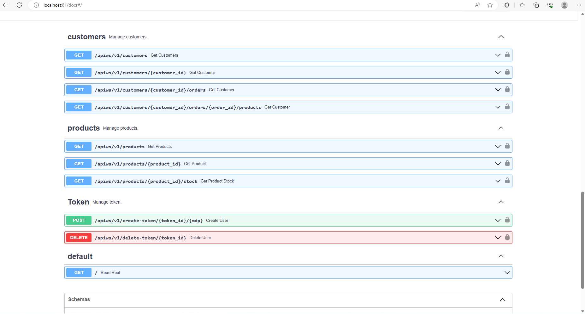
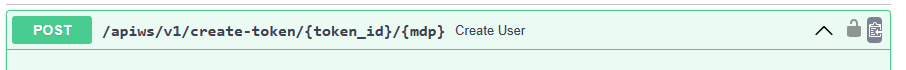
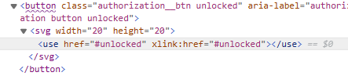
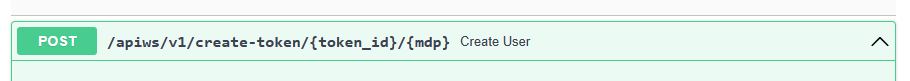
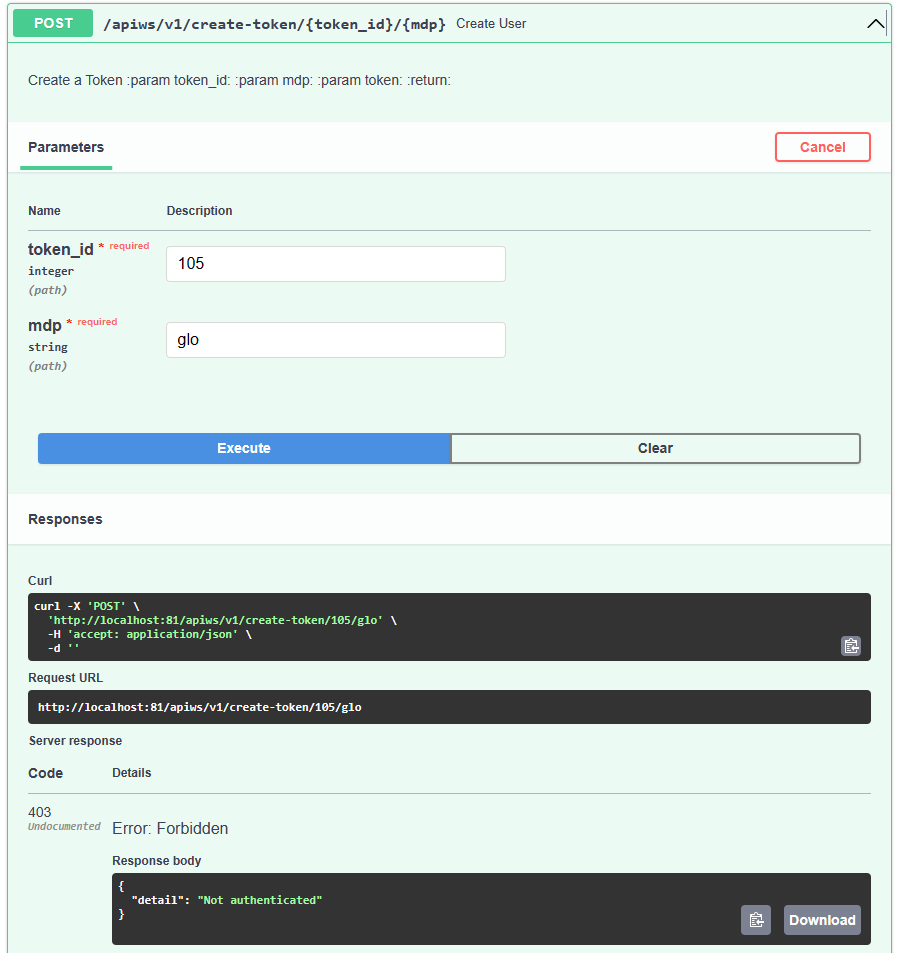
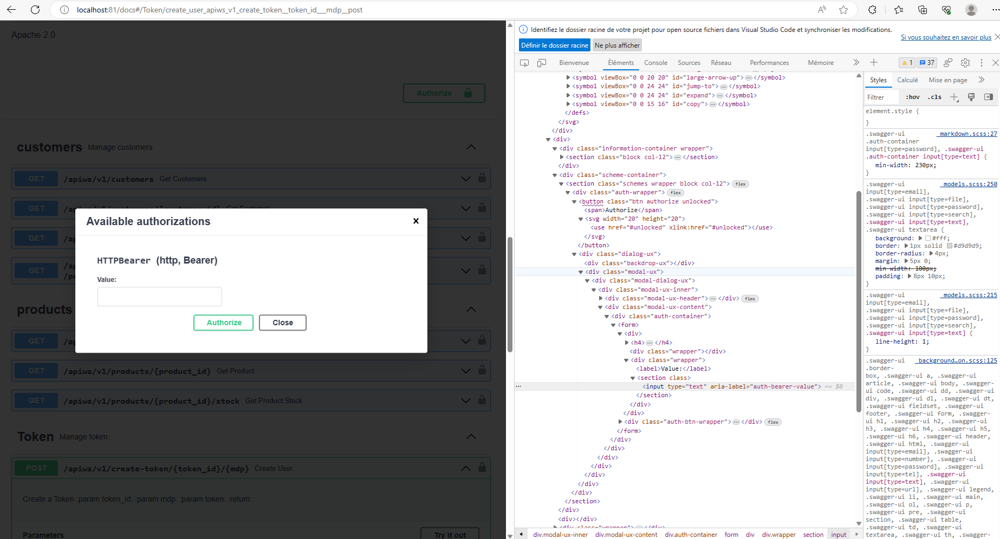
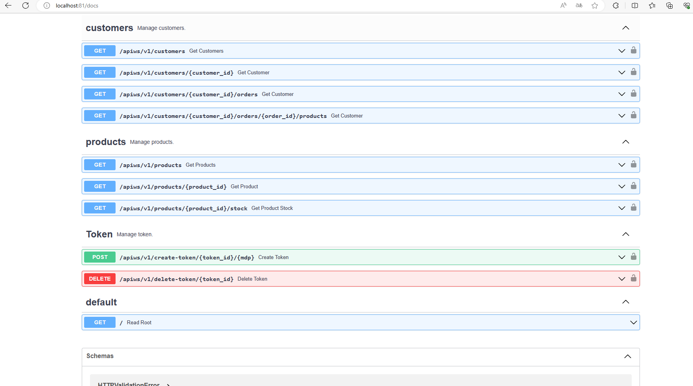
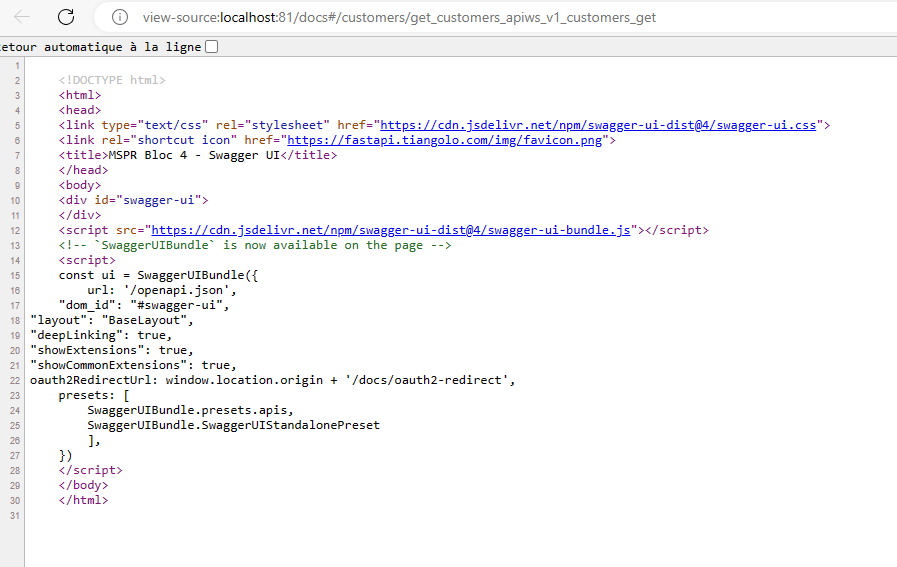

# Pour les test OWASP nous allons verrifier certains de ces test sur notre application API.

## 1 - Dans un premier temps nous allons commencer avec le test OWASP N°5

Ce test concerne le manque d'acces et de controle

pour cela nous allons tester a partir du DOM pour voir si on peut modifier des éléments:

nous allons tester a partir de la creation d'un User sur l'API de Webshopapi. 
    
Pour cela nous ferrons des tests a partir du swager de fast api.

    

on vas manipuler par le biais de l'inspection du DOM les éléments d'authorisations

    
qui correspond a cette partie du code visible sur le DOM

Si on modifie le code sur le DOM en supprimant tout le code concernant le bouton comme l'image ci dessous

le resultats est toujours une erreur 403 sur la non authorisation

si on accede au formulaire pour l'identification par le mot de passe 

on pourra observer que dans l'input du formulaire nous ne pouvons pas modifier les authorisations

Conclusion je pense que nous respectons le point N°5 du référentiel OWASP

## 2 - concernant le test Owasp n°6 sur l'oublie de metre en place de systeme de sécurité.

Pour constater si nous avons fait un oublie lors de la redaction du code source sur la securité nous allons ouvrir le code source de notre page "``localhost:81/docs``" de notre framework fastapi 

en tapant sur internet ``Ctrl+u`` 

Conclusion: nous avons passer ce test n°6 dans un premier temps parce que nous avons pris en compte et mis en place un systeme de securité. Mais aussi car le framework ``fastapi`` a pris en charge la page source html que l'on peut voir ci dessus et on constate que l'on a pas acces a grand chose a part le liens css l'icone et un fichier javascript concernant la licence d'utilisation.